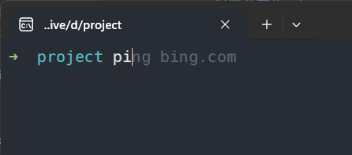

## 在Windows里做到Unix类系统的使用体验

+ 先上效果图:

  

### 前言

最近又回到使用 `Windows`环境开发。在 `Windows`下使用 `Unix`类系统的体验一直不是很好，尤其是在使用命令行时。Windows自带的命令行工具 `cmd` 和 `PowerShell` 都不如 `Unix` 系统下的 `bash` 和 `zsh` 好用。所以，我决定在 Windows 下折腾一下 `zsh`，并且能让zsh 在 `Windows Terminal` 中使用。

### 环境要求

以下步骤是在 `Windows 10+` 系统下进行的。`<small>`(更推荐Win11.截止到2024-03-26已经Win11-23H2-22631.3296)`</small>`

> 为了节省时间，文章中类似下载安装等基础入门的步骤我是用 `Gitub Copilot`生成的，并经过了我的审核避免一眼Ai犯的低级错误。

### 安装 Windows Terminal(必须)

#### 软件源

Windows Terminal 下载安装渠道有两种可信来源：

+ Microsoft Store 中下载安装
+ 从 GitHub 的 [releases](https://github.com/microsoft/terminal/releases) 页面下载最新的安装包。

> 任选其一即可，小白推荐使用 Microsoft Store 安装。

+ Method 1:

1. 打开 Microsoft Store，搜索 "Windows Terminal"。
2. 点击 "获取"，然后安装。
3. 安装完成后，打开 "开始" 菜单，找到并运行 "Windows Terminal"。

+ Method 2:

1. 访问 GitHub 的 [releases](https://github.com/microsoft/terminal/releases) 页面。
2. 下载最新的 `.msixbundle` 文件。
3. 双击下载的文件，开始安装。
4. 安装完成后，打开 "开始" 菜单，找到并运行 "Windows Terminal"。

### 安装 cygwin(极力推荐)

这里没有选择 [Git For Windows](https://git-scm.com/) 的原因就是：毕竟装上了就真的是装上了= = 啥也不知道。包括背后的原理。。

> `Cygwin` 是一个在 `Windows` 上运行的类 `Unix` 环境。它提供了一些类 `Unix` 系统下的工具和库，可以让你在 `Windows` 上使用类 Unix 系统的体验。

个人理解: `Cygwin` 就像Linux各种发行版系统的 `apt` `yum/dnf` `yay` `pkg` 等包管理工具(但它是一套环境)，可以非常方便的在 `Windows`系统上安装类Unix系统的工具和库。

+ 安装过程:
  

注意事项主要有:

+ `Cygwin` 的安装包可以从官网 [cygwin.com](https://cygwin.com/install.html) 下载。请直接下载 `setup-x86_64.exe`。
+ 安装时，选择安装 `zsh` 和 `git` 等工具。

### 配置 Windows Terminal 及 系统环境变量

#### 配置 `Windows Terminal`

概述: 打开 `Windows Terminal` 新增一个配置项，以便在 `Windows Terminal` 中使用 `Cygwin` 的 `zsh`。
步骤如下：

+ 打开 `Windows Terminal`。

> 默认情况下，`Windows Terminal` 会打开一个 `PowerShell` 窗口。我们需要新建一个配置项，以便在 `Windows Terminal` 中使用 `Cygwin` 的 `zsh`

+ 点击 `Windows Terminal` 窗口右上角的下拉菜单，选择 "设置"。
+ 在弹出的设置窗口中，找到 "+添加新配置文件选项" 点击。
+ 按照如图所示配置:

  

需要特别注意的是：

+ `commandline命令行` 配置项的值为 `Drive:\cygwin64\bin\zsh.exe --login -i`，( --login -i不加也没事= =?) 其中 `Drive`是驱动器路径， `Drive:\cygwin64` 是 `Cygwin` 的安装目录。
+ 启动目录建议设置到其他磁盘目录，如 `D:\YourNameDir`，我这设置的是 `D:\project` 其目的是避免某一天不得不重装系统。。。又或者C盘空间爆红时头疼。。当然，这一步可以在 `配置文件`->`默认值`->`启动目录`中进行全局设置，所有配置文件都会生效。
+ 回到左侧的配置列表，选择 `启动`->`默认配置文件` 选择刚刚新增的配置项，点击 "保存"，下次打开 Windows Terminal 时都会默认使用这个配置项(zsh)。

#### 配置系统环境变量

概述: 配置系统环境变量，以便在 `Windows Terminal` 中使用 `Cygwin` 的 `zsh`。

+ 打开 `Windows` 的 "控制面板"。
+ 点击 "系统和安全"。
+ 点击 "系统"。
+ 点击 "高级系统设置"。
+ 在弹出的 "系统属性" 窗口中，点击 "环境变量"。
+ 在 "系统变量" 中，找到 "Path"，点击 "编辑"。
+ 点击 "新建"，添加 `Cygwin` 的 `bin` 目录，如 `Drive:\cygwin64\bin` 还有个 `Drive:\cygwin64\sbin`。
+ 点击 "确定"，保存配置。

### 在Windows Terminal 中测试 zsh可用性

#### 验证配置

点击 `Windows Terminal`，如果前面配置正确。那默认就是 `Cygwin` 的 `zsh`啦。

### 配置及美化zsh

#### 安装 oh-my-zsh

概述: 安装 `oh-my-zsh`，以便配置和美化 `zsh`。

+ 打开 `Windows Terminal`。
+ 运行以下命令安装 `oh-my-zsh`：

```bash
# 安装 oh-my-zsh(首选)
sh -c "$(curl -fsSL https://raw.github.com/ohmyzsh/ohmyzsh/master/tools/install.sh)"
```

> 在大陆地区，如果遇到网络问题，可以使用以下命令安装(清华大学Tuna镜像)：

```bash
# 安装 oh-my-zsh(备选)
git clone https://mirrors.tuna.tsinghua.edu.cn/git/ohmyzsh.git
cd ohmyzsh/tools
REMOTE=https://mirrors.tuna.tsinghua.edu.cn/git/ohmyzsh.git sh install.sh
```

+ 安装完成后，重启 Windows Terminal。
+ 如果你想更换主题，可以在 `~/.zshrc` 文件中修改 `ZSH_THEME` 的值。
+ 重启 Windows Terminal，查看效果。
+ 如果你想安装插件，可以在 `~/.zshrc` 文件中添加插件，然后重启 Windows Terminal。
+ 推荐一个插件：`zsh-autosuggestions`，可以自动补全命令。
+ 安装方法如下：

```shell
git clone --depth=1  https://github.com/zsh-users/zsh-autosuggestions $ZSH_CUSTOM/plugins
```

#### 安装zsh-autosuggestions插件

+ 配置 `~/.zshrc` 文件，添加 `zsh-autosuggestions` 字段如下:

```shell
nano ~/.zshrc
# 修改 plugins 配置项，添加 zsh-autosuggestions 插件,最终修改结果:
plugins=(git zsh-autosuggestions)
```

+ 重启 Windows Terminal，查看效果。

  

## 引用

+ oh-my-zsh 官网: [oh-my-zsh](https://ohmyz.sh/) Github仓库地址: [oh-my-zsh](https://github.com/ohmyzsh/ohmyzsh)
+ [Windows安装Zsh终端](https://juejin.cn/post/7229507721795993661)
+ [一文搞定 Windows Terminal 设置与 zsh 安装【非WSL】](https://zhuanlan.zhihu.com/p/455925403)
+ [msys2](https://www.msys2.org/) A collection of tools and libraries providing you with an easy-to-use environment for building, installing and running native Windows software.
  > 写这篇文章因为是在Windows操作的。。所以同时还遇到了CRLF换行符的问题，这个问题在Linux下是不会遇到的，但是在Windows下就会遇到，解决方法参考： [Github-Docs:CRLF换行符问题](https://docs.github.com/zh/get-started/getting-started-with-git/configuring-git-to-handle-line-endings)
+ [在Windows上添加git-credentials](https://stackoverflow.com/questions/46878457/adding-git-credentials-on-windows)
