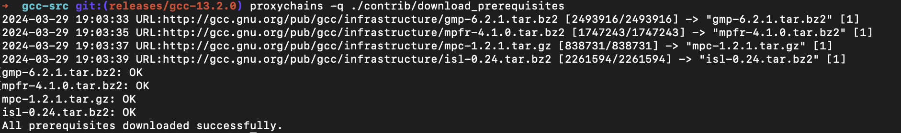

## 前言

前段时间一直利用课余时间在协助一家公司进行一些产品的测试工作，由于项目的特殊性，需要使用到一些最新的特性，现有`apt`源 中的GCC 版本过低，且即便是添加`apt ppa`源可以解决一部分问题，但是还要折腾网络环境(众所周知xx的一些问题)所以我决定自己编译安装一个最新的 GCC 版本，方便以后直接复用。

## 概述

本文将介绍如何在 Debian/Ubuntu 系统上编译安装 GCC 13.2.0。

### 什么是 GCC？

GCC 是 GNU Compiler Collection 的缩写，是一个由 GNU 开发的编译器集合，支持多种编程语言，如 C、C++、Objective-C、Go 等。

说白了，GCC 就是一个编译器，它可以将源代码编译成可执行文件。然后可以直接在目标系统上运行。

## 准备工作

### 环境需求

- Debian 12 或 Ubuntu 22.04 LTS系统(强烈推荐这两个版本)或者其他任何基于 Debian 甚至`Apline`(也许?)的系统。
- 一个可以访问外网的网络环境。(推荐, 如果你不理解我在说什么.你可以寻找任意方法只要能顺利且快速的git获取到GCC源码即可, 这里推荐[Tsinghua Tuna镜像站](https://mirrors.tuna.tsinghua.edu.cn/help/gcc.git/))
- 已有gcc/g++版本(如果没有请先安装)安装方法:`sudo apt install build-essential`
- ~~智慧或灵活的~~脑子
  
### 编译前准备

```bash
sudo apt update
sudo apt install -y build-essential flex bison
sudo apt install -y libgmp-dev libmpfr-dev libmpc-dev
sudo apt install -y libisl-dev libcloog-isl-dev
sudo apt install -y libssl-dev
```

### 下载/克隆 GCC 源码

```bash
git clone -b releases/gcc-13.2.0 --depth=1 https://gcc.gnu.org/git/gcc.git gcc-src
```

- 对于中国大陆用户，可以使用[清华大学开源软件镜像站](https://mirrors.tuna.tsinghua.edu.cn/help/gcc.git/)下载 GCC 源码，具体命令如下：

```bash
git clone -b releases/gcc-13.2.0 --depth=1 https://mirrors.tuna.tsinghua.edu.cn/git/gcc.git gcc-src
```

## 编译安装

### 下载依赖

```bash
cd gcc-src
./contrib/download_prerequisites
```

- 对于`./contrib/download_prerequisites`这个命令, 如果你在中国大陆, 你可能会遇到下载不了的问题, 这个时候你可以手动下载, 然后放到`gcc-src`目录下, 然后再执行`./contrib/download_prerequisites`这个命令, 会自动检测并跳过下载。或者。像我一样使用`proxychains`这个工具(强烈推荐), 代理下载。
  
像我这样就是下载成功的


### 配置

```bash
./configure --prefix=/usr/local/gcc-13.2.0 --enable-languages=c,c++ --disable-multilib
```

### 编译

```bash
make -j$(nproc) | tee build.log
```

### 编译出deb包

正在整理中...

### 安装

```bash
sudo make install
```

### 验证

```bash
/usr/local/gcc-13.2.0/bin/gcc --version
```

### 配置环境变量

> 我使用`zsh`作为我的shell, 所以我会在`~/.zshrc`文件中添加环境变量, 如果你使用的是`bash`或者其他shell, 请自行修改对应的配置文件。

```bash
echo 'export PATH="$PATH:/usr/local/gcc-13.2.0/bin"' >> ~/.zshrc
source ~/.zshrc
```

### 验证环境变量

```bash
gcc --version
```
