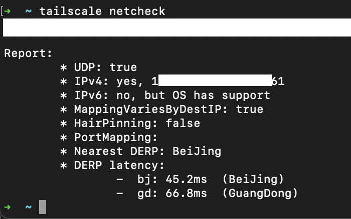
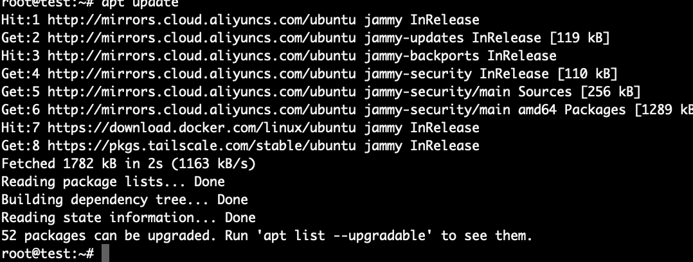

## 前言

在阿里云中，大学生通过身份认证后可免费[直接领取一台1个月的ECS云服务器](https://developer.aliyun.com/plan/student)。做完任务后自动续费半年。任务简单的很。搭建一个Wordpress博客。

这台免费的服务器规格是: 2核 4GB，1Mbps带宽，40GB SSD 系统盘。**100%独享CPU**
不是那种以前拉垮的`突发性能t5实例`。

这个配置，这个性能足够用来搭建个人博客、各种小型网站、个人云盘、游戏服务器(什么Minecraft 幻兽帕鲁 七日杀(7 Days to die) balabala等等太多了)

阿里云还是很大方的。

但是!!! 当我准备在上面跑`derper`+`tailscale`的时候。发现了致命的问题= =:

## 问题描述

开启 `Tailscale` 后，使用 `apt` 进行软件更新时会无法连接到内网镜像站 `mirrors.aliyuncs.com`

### 问题排查

经查: `tailscale` 的[默认ip段是固定的](https://tailscale.com/kb/1033/ip-and-dns-addresses#mapping-machine-names-to-ip-addresses-using-dns) `100.100.x.x` 且目前来看无法直接更改。

> 分配 `100.64.0.0/10` 子网中的地址（从 `100.64.0.0` 到 `100.127.255.255`）。这称为`运营商级 NAT`(CGNAT) 地址空间，由 `RFC6598`（IANA 为共享地址空间保留的 IPv4 前缀）保留。 这段话取自[Tailscale官方文档](https://tailscale.com/kb/1015/100.x-addresses)

戏剧性的重点来了： 阿里云默认的内网dns地址也在 `100.xyz`网段。这恰好和 `tailscale`的ip段冲突了。

这就导致了我在使用 `tailscale` 的同时，由于路由冲突问题，无法使用阿里云的内网解析服务，具体影响如下:

+ 影响使用内网地址访问`oss`等等。甚至是`ecs`之间的内网通信。
+ 影响到我使用阿里云的内网镜像站 `mirrors.aliyuncs.com` ，进而影响使用apt/dnf等包管理器进行更新。

本以为能通过修改 `Tailscale` 的ACL配置可以解决问题。但是 `Tailscale` 的ip段是不支持修改的。所以只能通过修改内网DNS的方式来解决这个问题。

### 解决方案

说了这么多。直接贴出来阿里云内网的DNS服务器ip地址吧:

+ 100.100.2.136
+ 100.100.2.137
+ 100.100.2.138

上述3个ip地址都是可以正常解析 `mirrors.aliyuncs.com` 及其其他的内网服务的。

由于我采用的是`Ubuntu 22.04 LTS` 直接修改`/etc/resolv.conf`文件是不行的。因为这个文件是由`systemd-resolved`管理的。现在你有两个选择：

+ 继续采用并保留`systemd-resolved`，可以通过修改`/etc/systemd/resolved.conf`文件来解决这个问题。(麻烦)
+ 直接干掉`systemd-resolved`，直接简单粗暴的管理`/etc/resolv.conf`文件。(推荐)

```bash
sudo systemctl stop systemd-resolved
sudo systemctl disable systemd-resolved
sudo systemctl mask systemd-resolved
```

ok.现在你可以直接修改`/etc/resolv.conf`文件了。

```bash
sudo nano /etc/resolv.conf
```

增加如下内容：

```text
nameserver 100.100.2.136
nameserver 100.100.2.137
nameserver 100.100.2.138
```

至于如何根治- -感觉需要修改`tailscale`分配ip的这一段的代码（？）使用Headscale魔改也许ok - -没精力折腾了。~~能用就行~~

2024-03-29 20:46:13更新: 好像也不太行. 直接看下面的临时解决方法吧= =。

### 临时解决方法

临时解决方案就是 `tailscale down` 停掉 `tailscale` 服务。然后这期间正常使用内网dns。使用过后再启动 `tailscale` 服务。

+ 最终效果：

    

+ 而且对于内网的访问也是正常的：

    
