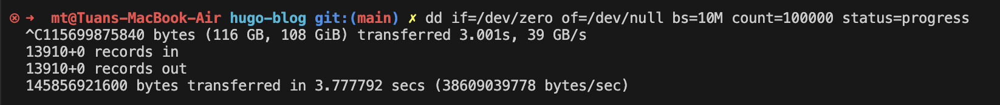

## 问题

在Linux/Unix类系统中，`dd`命令是一个非常实用的工具，它可以用来复制文件、磁盘、分区等。但是，当`dd`命令在运行时，它不会显示任何进度信息，这可能会让你感到焦虑和困惑：到底dd了多少啊啊啊啊啊。那么，有没有办法让`dd`命令在运行时显示进度呢？

## 解决方案

### dd命令加上status=progress参数

在GNU `Coreutils` `8.24`版本之后，`dd`命令增加了一个`status=progress`参数，可以用来显示进度信息。你可以像下面这样使用它：

```bash
dd if=/dev/zero of=/dev/null bs=1M count=1000 status=progress
```

`status=progress`参数会让`dd`命令显示进度信息，如图



### 使用kill命令

如果你只是想查看`dd`命令的进度信息，也可以使用`kill`命令来实现。你可以像下面这样使用它：

```bash
# 启动dd命令
dd if=/dev/zero of=/dev/null bs=10M count=100000 & # 放到后台执行
# 获取dd命令的进程ID
PID=$!
# 每隔1秒输出进度信息
while ps -p $PID > /dev/null; do kill -USR1 $PID; sleep 1; done
```

在这个示例中，我们使用`dd`命令从`/dev/zero`设备读取数据，并将其写入`/dev/null`设备。然后，我们使用`kill`命令每隔1秒输出`dd`命令的进度信息。

这种方法可以在不安装额外软件的情况下实现显示进度信息的功能，毕竟`kill`命令是Linux系统自带的工具，同时，这个也适用于最开始执行`dd`后忘记加`status=progress` 参数时，可以用这种方法补救。

## 总结

以上就是在Linux/Unix系统中使用`dd`命令显示进度信息的两种常用方法。你可以根据自己的需求选择合适的方法。
