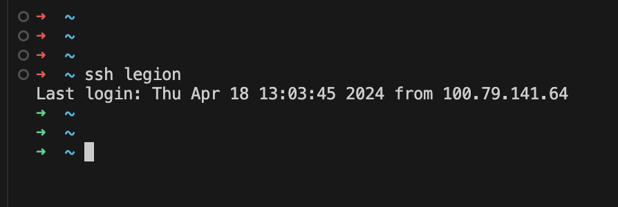
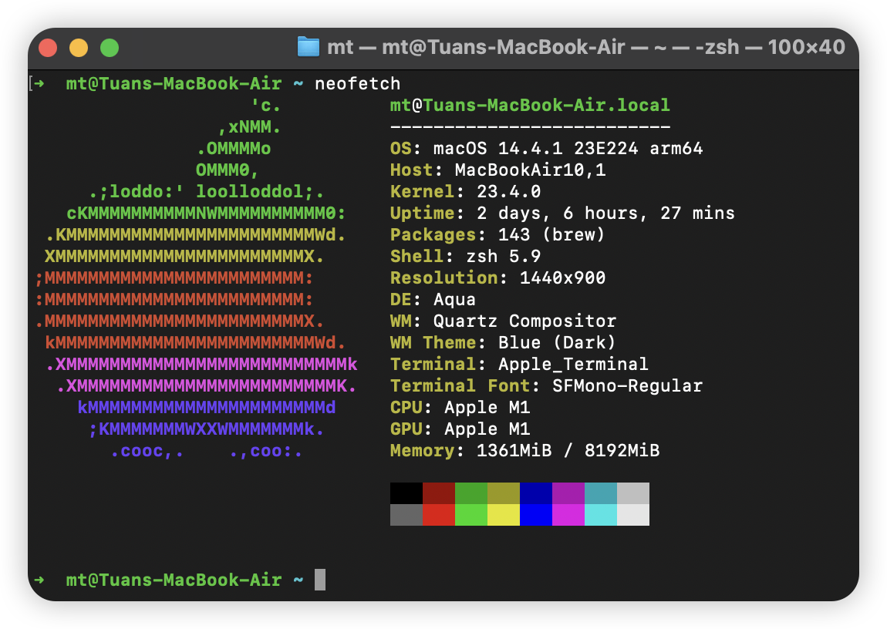
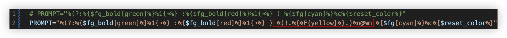

## 前言

安装zsh以后，我们可以通过安装oh-my-zsh来美化我们的终端，oh-my-zsh是一个开源的zsh配置管理工具，它提供了很多主题和插件，可以让我们的终端更加美观和实用。

对我以及一部分人而言。ohmyzsh带来的惊喜并不是那么的大，虽然它的一些自动补全，主题，插件确实非常非常特别的实用，但是还是给予它更高的期待。希望增加一些有利于提升自己工作效率的插件，主题样式，以及一些实用的功能。

!!!本文会持续更新下去，贴出自己的配置，经验等等。如果你有好的建议，欢迎在评论区留言。

## 安装oh-my-zsh

不再赘述，参考我之前的一篇文章，配置及美化zsh章节[为Windows Terminal 配置zsh + Oh-My-Zsh! [非WSL]](/post/configure-zsh-for-windows-terminal#配置及美化zsh)

## 美化

暂时分为两部分：外观美化（主题），功能性实用性美化

### 功能/实用性美化

首先就是对默认主题`robbyrussell`进行的一些美化。

在默认情况下，`robbyrussell`主题的显示效果如下：

```shell
➜  hugo-blog git:(main) ✗ command here
```

详细解释：

+ 对于`➜`符号，你可以通过它的颜色来简单的判断最后一次命令是否执行成功，如果是绿色，表示执行成功，如果是红色，表示执行失败。

+ 该主题默认启用了git插件，对于`git`这个部分:
  + `git:(main)` 中的 `git` 通常表示当前目录下有`.git`文件夹，且还代表这个文件夹由`git`管理。
  + `git:(main)` 中的 `main` 通常显示当前分支名称。
  + 最后面的 `✗` 表示当前分支是否有未提交的文件，如果有未提交的文件，会显示为红色的`✗`，如果没有未提交的文件，会显示为绿色的`✔`。

> 以下是个人对该主题的一些见解

 由于我经常进行一些远程ssh/开发等操作，本机也同样安装了zsh+ohmyzsh，所以我希望能够在终端的左侧显示当前的主机名以及用户名，这样我就可以很方便的知道当前是在哪个主机上进行操作。。。~~没注意标题栏的主机名 混淆本地/远程/多个远程 导致误操作的这种事我干了好几次了。。~~

+ 就像这个样子: 
  

这咋分清嘛。。。除了本地的前面有个`⭕️`，其他的都一样。。。稍不留神ohhhhhh

所以我对`robbyrussell`主题进行了一些修改，使其显示效果如下：



这样就会显示当前的主机名以及用户名，方便我们进行区分。

### 具体实现方法

修改`robbyrussell`主题的文件，文件路径为`~/.oh-my-zsh/themes/robbyrussell.zsh-theme`，或者直接:

```shell
code $ZSH/themes/robbyrussell.zsh-theme
```

用`VSCode`打开该文件。作出如下操作：



主要的代码如下,你只需要把下面的代插入到上图中指定位置。

```plaintext
%(!.%.)%n@%m
```

## 更新进度

+ [x] 2024-04-18: 完成了对`robbyrussell`主题的修改，使其显示当前的主机名以及用户名。

## 引用

为了尊重原作者的版权，特此引用原作者的链接，如有侵权，请联系我删除。

+ [oh-my-zsh提示符显示当前用户名和主机名](https://blog.csdn.net/toopoo/article/details/104445447)
