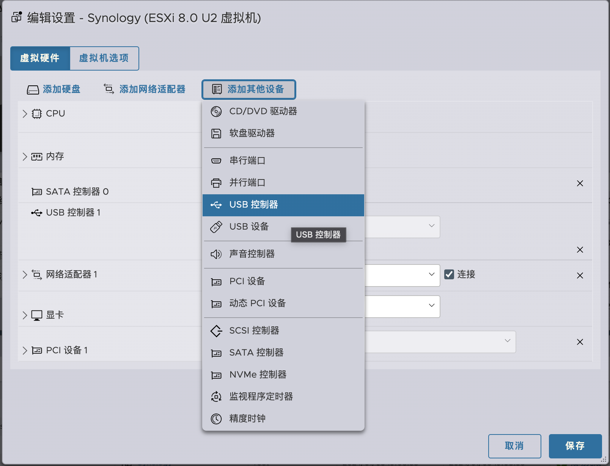
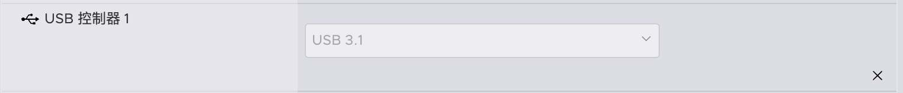

## ESXi将虚拟磁盘镜像模拟USB设备

### 背景

今天在家里的`R730xd`上折腾`Synology`的引导。继`ARPL`断更，arpl-i18n删库（版权问题）。引导转而采用了[`Arc Loader`](https://github.com/AuxXxilium/arc)

在介质上，现有的黑群晖引导介质有这几种：

+ U盘引导
+ 硬盘引导
+ 虚拟硬盘引导

这里主要介绍最后一种`虚拟硬盘引导`

### 准备工作

+ EXSi启用SSH
+ 能通过SSH连接到ESXi
  
### 操作步骤

1.新建虚拟机，唯一需要注意的是：删除所有的USB控制器，重新添加一个`USB控制器`，并选择`USB 3.1`.如图所示:





2.将引导镜像上传到ESXi的数据存储中，我这里是`/vmfs/volumes/datastore1/Synology/synoboot.vmdk`

3.通过`SSH`连接到`ESXi`，用`vi`编辑`vmx`虚拟机配置文件：
> 这里假设我的虚拟机名字为`Synology`

```bash
vi /vmfs/volumes/datastore1/Synology/Synology.vmx
```

在文件末尾添加以下内容：

```text
usb_xhci:3.present = "TRUE"
usb_xhci:3.deviceType = "disk"
usb_xhci:3.fileName = "synoboot.vmdk"
```

其中synoboot.vmdk是引导文件的虚拟磁盘。你可以通过`scp`等方式上传。或者`ESXi`的 `Web-ui`界面上传均可。

启动。。接续的所有配置

效果：


## 引用

+ [在 ESXi 中完美虚拟 Xpenology DSM 6.2.](https://snailium.com/server/xpenology-complete-virtualization-in-esxi.html)
